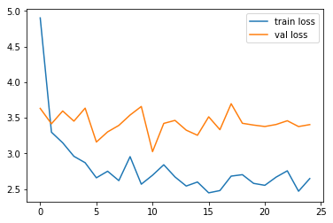
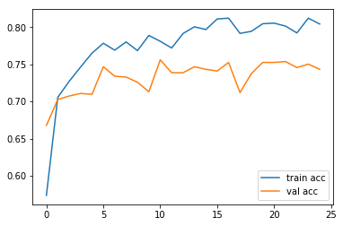
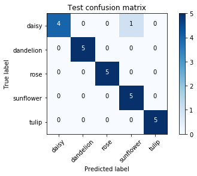

# Transfter training with VGG and flower dataset
This is a transfer training practice with keras VGG16 model and the flower dataset on kaggle.  
I also randomly pick up some images from google for the tiny test dataset. The weights used in this model is `imagenet` 

### Environment
- Python 3.6
- Tensorflow 1.10.0
- Keras 2.1.6
- CUDA 9.0


```python
from __future__ import print_function, division
from builtins import range, input

from keras.models import Model
from keras.layers import Dense, Flatten, Dropout
from keras.applications.vgg16 import VGG16, preprocess_input
from keras.preprocessing.image import ImageDataGenerator
import matplotlib.pyplot as plt
import numpy as np
from sklearn.metrics import confusion_matrix
import itertools
```


```python
from glob import glob
```


```python
# Fruit 360 image: 100x100x3
IMAGE_SIZE = [100, 100]
```


```python
epochs = 25
batch_size = 32
validation_split = 0.2
```

# Data preparation


```python
train_dir = '../../../large_files/flowers/'
```


```python
test_dir = '../../../large_files/flower_test/'
```


```python
# using glob to fetch a list of images
image_list = glob(train_dir+'/*/*.jp*g')
```


```python
# using glob to fetch a list of class names
folder = glob(train_dir+'/*')
```


```python
len(folder)
```


    5


```python
# Using validation split and subset to seperate training/validation set
generator = ImageDataGenerator(
  rotation_range=30,
  width_shift_range=0.2,
  height_shift_range=0.2,
  shear_range=0.2,
  zoom_range=0.2,
  horizontal_flip=True,
  vertical_flip=True,
  fill_mode = 'wrap',
  preprocessing_function=preprocess_input,
  validation_split =validation_split
)
```


```python
train_gen = generator.flow_from_directory(train_dir,
                                          target_size=IMAGE_SIZE, 
                                          batch_size=batch_size, 
                                          shuffle=True,
                                         subset='training')
```

    Found 3462 images belonging to 5 classes.


```python
val_gen = generator.flow_from_directory(train_dir, 
                                         target_size=IMAGE_SIZE, 
                                         batch_size=batch_size, 
                                         shuffle=True,
                                        subset='validation')
```

    Found 861 images belonging to 5 classes.


```python
train_gen.class_indices
```


    {'daisy': 0, 'dandelion': 1, 'rose': 2, 'sunflower': 3, 'tulip': 4}


```python
train_gen.samples
```


    3462


```python
# initializing label list and feeding in classes/indices
labels = [None]*len(train_gen.class_indices)

for item, indice in train_gen.class_indices.items():
    labels[indice] = item
```


```python
labels
```


    ['daisy', 'dandelion', 'rose', 'sunflower', 'tulip']


# Model construction


```python
# do not include top fully-connected layer for customized training
vgg_model = VGG16(include_top=False, input_shape = IMAGE_SIZE + [3], weights='imagenet')
```


```python
# Do not update weights as we use imagenet weights
for layer in vgg_model.layers:
    layer.trainable = False
```


```python
x = Flatten()(vgg_model.output)
```


```python
# changing the output class number to our data class numbers
prediction = Dense(len(folder),activation='softmax')(x)
```


```python
model = Model(inputs=vgg_model.input, outputs=prediction)
```


```python
model.summary()
```

    _________________________________________________________________
    Layer (type)                 Output Shape              Param #   
    =================================================================
    input_1 (InputLayer)         (None, 100, 100, 3)       0         
    _________________________________________________________________
    block1_conv1 (Conv2D)        (None, 100, 100, 64)      1792      
    _________________________________________________________________
    block1_conv2 (Conv2D)        (None, 100, 100, 64)      36928     
    _________________________________________________________________
    block1_pool (MaxPooling2D)   (None, 50, 50, 64)        0         
    _________________________________________________________________
    block2_conv1 (Conv2D)        (None, 50, 50, 128)       73856     
    _________________________________________________________________
    block2_conv2 (Conv2D)        (None, 50, 50, 128)       147584    
    _________________________________________________________________
    block2_pool (MaxPooling2D)   (None, 25, 25, 128)       0         
    _________________________________________________________________
    block3_conv1 (Conv2D)        (None, 25, 25, 256)       295168    
    _________________________________________________________________
    block3_conv2 (Conv2D)        (None, 25, 25, 256)       590080    
    _________________________________________________________________
    block3_conv3 (Conv2D)        (None, 25, 25, 256)       590080    
    _________________________________________________________________
    block3_pool (MaxPooling2D)   (None, 12, 12, 256)       0         
    _________________________________________________________________
    block4_conv1 (Conv2D)        (None, 12, 12, 512)       1180160   
    _________________________________________________________________
    block4_conv2 (Conv2D)        (None, 12, 12, 512)       2359808   
    _________________________________________________________________
    block4_conv3 (Conv2D)        (None, 12, 12, 512)       2359808   
    _________________________________________________________________
    block4_pool (MaxPooling2D)   (None, 6, 6, 512)         0         
    _________________________________________________________________
    block5_conv1 (Conv2D)        (None, 6, 6, 512)         2359808   
    _________________________________________________________________
    block5_conv2 (Conv2D)        (None, 6, 6, 512)         2359808   
    _________________________________________________________________
    block5_conv3 (Conv2D)        (None, 6, 6, 512)         2359808   
    _________________________________________________________________
    block5_pool (MaxPooling2D)   (None, 3, 3, 512)         0         
    _________________________________________________________________
    flatten_1 (Flatten)          (None, 4608)              0         
    _________________________________________________________________
    dense_1 (Dense)              (None, 5)                 23045     
    =================================================================
    Total params: 14,737,733
    Trainable params: 23,045
    Non-trainable params: 14,714,688
    _________________________________________________________________


```python
model.compile(
    optimizer='Adam', 
    loss='categorical_crossentropy',
    metrics=['accuracy'])
```


```python
result = model.fit_generator(generator=train_gen, 
                    steps_per_epoch = train_gen.samples//batch_size,
                    epochs=epochs, 
                    validation_data=val_gen,
                    validation_steps=val_gen.samples//batch_size,
                    shuffle=True)
```

    Epoch 1/25
    108/108 [==============================] - 39s 357ms/step - loss: 4.9082 - acc: 0.5729 - val_loss: 3.6324 - val_acc: 0.6678
    Epoch 2/25
    108/108 [==============================] - 29s 269ms/step - loss: 3.2814 - acc: 0.7052 - val_loss: 3.4165 - val_acc: 0.7027
    Epoch 3/25
    108/108 [==============================] - 29s 267ms/step - loss: 3.1435 - acc: 0.7279 - val_loss: 3.5960 - val_acc: 0.7073
    Epoch 4/25
    108/108 [==============================] - 29s 267ms/step - loss: 2.9596 - acc: 0.7458 - val_loss: 3.4535 - val_acc: 0.7108
    Epoch 5/25
    108/108 [==============================] - 29s 271ms/step - loss: 2.8614 - acc: 0.7655 - val_loss: 3.6359 - val_acc: 0.7096
    Epoch 6/25
    108/108 [==============================] - 30s 281ms/step - loss: 2.6393 - acc: 0.7801 - val_loss: 3.1609 - val_acc: 0.7468
    Epoch 7/25
    108/108 [==============================] - 28s 261ms/step - loss: 2.7708 - acc: 0.7683 - val_loss: 3.3029 - val_acc: 0.7340
    Epoch 8/25
    108/108 [==============================] - 28s 257ms/step - loss: 2.6034 - acc: 0.7806 - val_loss: 3.3938 - val_acc: 0.7329
    Epoch 9/25
    108/108 [==============================] - 28s 263ms/step - loss: 2.9537 - acc: 0.7690 - val_loss: 3.5391 - val_acc: 0.7259
    Epoch 10/25
    108/108 [==============================] - 27s 247ms/step - loss: 2.5906 - acc: 0.7880 - val_loss: 3.6592 - val_acc: 0.7131
    Epoch 11/25
    108/108 [==============================] - 26s 243ms/step - loss: 2.6954 - acc: 0.7814 - val_loss: 3.0258 - val_acc: 0.7561
    Epoch 12/25
    108/108 [==============================] - 26s 242ms/step - loss: 2.8410 - acc: 0.7725 - val_loss: 3.4217 - val_acc: 0.7387
    Epoch 13/25
    108/108 [==============================] - 26s 243ms/step - loss: 2.6915 - acc: 0.7906 - val_loss: 3.4642 - val_acc: 0.7387
    Epoch 14/25
    108/108 [==============================] - 26s 243ms/step - loss: 2.5450 - acc: 0.8008 - val_loss: 3.3271 - val_acc: 0.7468
    Epoch 15/25
    108/108 [==============================] - 26s 238ms/step - loss: 2.6003 - acc: 0.7969 - val_loss: 3.2555 - val_acc: 0.7433
    Epoch 16/25
    108/108 [==============================] - 26s 239ms/step - loss: 2.4226 - acc: 0.8114 - val_loss: 3.5142 - val_acc: 0.7410
    Epoch 17/25
    108/108 [==============================] - 26s 245ms/step - loss: 2.4804 - acc: 0.8122 - val_loss: 3.3338 - val_acc: 0.7526
    Epoch 18/25
    108/108 [==============================] - 26s 244ms/step - loss: 2.6877 - acc: 0.7911 - val_loss: 3.6977 - val_acc: 0.7120
    Epoch 19/25
    108/108 [==============================] - 26s 242ms/step - loss: 2.7014 - acc: 0.7935 - val_loss: 3.4234 - val_acc: 0.7375
    Epoch 20/25
    108/108 [==============================] - 27s 248ms/step - loss: 2.5811 - acc: 0.8047 - val_loss: 3.3984 - val_acc: 0.7526
    Epoch 21/25
    108/108 [==============================] - 26s 238ms/step - loss: 2.5760 - acc: 0.8047 - val_loss: 3.3783 - val_acc: 0.7526
    Epoch 22/25
    108/108 [==============================] - 26s 240ms/step - loss: 2.6685 - acc: 0.8015 - val_loss: 3.4065 - val_acc: 0.7538
    Epoch 23/25
    108/108 [==============================] - 25s 233ms/step - loss: 2.7562 - acc: 0.7929 - val_loss: 3.4590 - val_acc: 0.7456
    Epoch 24/25
    108/108 [==============================] - 26s 244ms/step - loss: 2.4711 - acc: 0.8122 - val_loss: 3.3777 - val_acc: 0.7503
    Epoch 25/25
    108/108 [==============================] - 25s 232ms/step - loss: 2.6089 - acc: 0.8073 - val_loss: 3.4051 - val_acc: 0.7433


```python
model.save('vgg_flower_50epoch_100.h5')
```

# Result and confusion matrix


```python
# loss
plt.plot(result.history['loss'], label='train loss')
plt.plot(result.history['val_loss'], label='val loss')
plt.legend()
plt.show()

# accuracies
plt.plot(result.history['acc'], label='train acc')
plt.plot(result.history['val_acc'], label='val acc')
plt.legend()
plt.show()
```








```python
def get_conf_matrix(data_dir, size):
    predictions =[]
    true_y = []

    for x,y in generator.flow_from_directory(data_dir, batch_size=5, target_size=IMAGE_SIZE,shuffle=False):
        prediction = model.predict(x)
        
        # decoding one-hot
        prediction = np.argmax(prediction, axis=1)
        y = np.argmax(y, axis =1)
        
        predictions = np.concatenate((predictions, prediction))
        true_y = np.concatenate((true_y, y))
        if len(predictions) >=size:
            break
    matrix = confusion_matrix(true_y, predictions)
    return matrix
```


```python
from keras.models import load_model
```


```python
model =load_model('vgg_flower_50epoch_100.h5')
```


```python
# test on a tiny test set
test_img_list = glob(test_dir+'*/*.jp*g')
```


```python
len(test_img_list)
```


    25


```python
conf_matrix = get_conf_matrix(test_dir, len(test_img_list))
```

    Found 25 images belonging to 5 classes.


```python
print(conf_matrix)
```

    [[4 0 0 1 0]
     [0 5 0 0 0]
     [0 0 5 0 0]
     [0 0 0 5 0]
     [0 0 0 0 5]]


```python
def plot_confusion_matrix(cm, classes,
                          normalize=False,
                          title='Confusion matrix',
                          cmap=plt.cm.Blues):
    """
    This function prints and plots the confusion matrix.
    Normalization can be applied by setting `normalize=True`.
    """
    if normalize:
        cm = cm.astype('float') / cm.sum(axis=1)[:, np.newaxis]
        print("Normalized confusion matrix")
    else:
        print('Confusion matrix, without normalization')

    print(cm)

    plt.imshow(cm, interpolation='nearest', cmap=cmap)
    plt.title(title)
    plt.colorbar()
    tick_marks = np.arange(len(classes))
    plt.xticks(tick_marks, classes, rotation=45)
    plt.yticks(tick_marks, classes)

    fmt = '.2f' if normalize else 'd'
    thresh = cm.max() / 2.
    for i, j in itertools.product(range(cm.shape[0]), range(cm.shape[1])):
        plt.text(j, i, format(cm[i, j], fmt),
                 horizontalalignment="center",
                 color="white" if cm[i, j] > thresh else "black")

    plt.tight_layout()
    plt.ylabel('True label')
    plt.xlabel('Predicted label')
```


```python
plot_confusion_matrix(conf_matrix, labels, title = "Test confusion matrix")
```

    Confusion matrix, without normalization
    [[4 0 0 1 0]
     [0 5 0 0 0]
     [0 0 5 0 0]
     [0 0 0 5 0]
     [0 0 0 0 5]]





```python
from keras import backend as K
K.clear_session()
```
